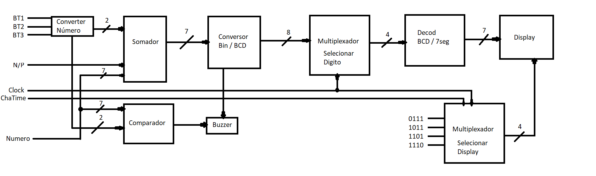
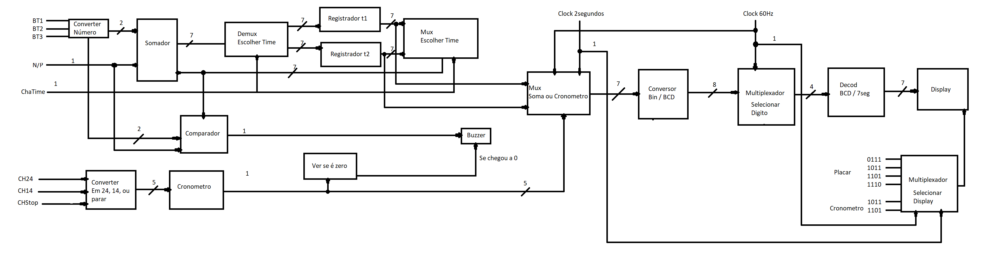
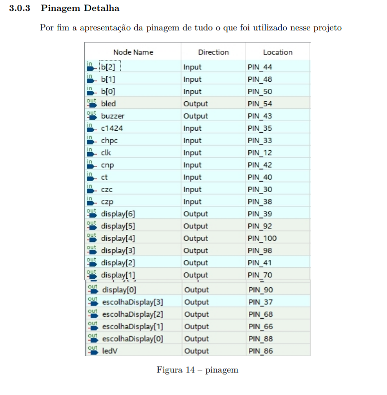
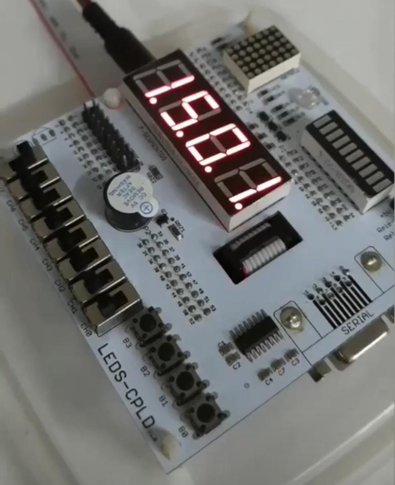
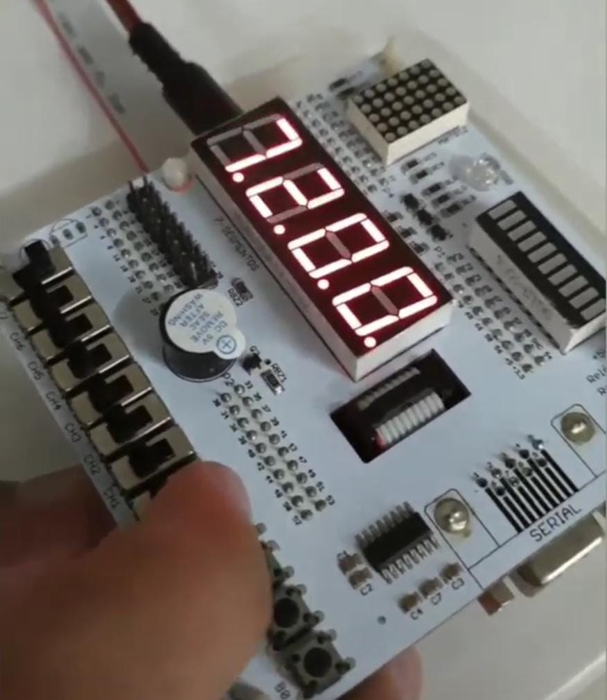

# Placar Jogo de Basquete, Feito em Verilog
Um projeto de circuitos digitais que simula um placar de jogo de basquete

## Circuito MVP

## Circuito Completo

## Pinagem 

## Descrição Botões

## Funcionamento no CPLD MAXII Versão T100C5

